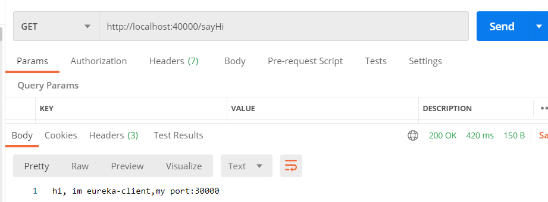

## Feign的介绍

通过之前的学习，我们对Feign的印象为，服务间调用的组件，那么就有疑问了，服务间调用从一开始的Eureka，Ribbon，都可以实现，为什么要使用Feign呢？而且看起来它还特别重要？

我们先看看之前Eureka以及Ribbon的调用方式：


具有强迫症and代码洁癖的人一眼就看出问题了：**请求地址需要拼接，并且写死在代码中**，这肯定忍不了了，再加上还需要配合RestTemplate使用才可以，也太麻烦了，每个Service或者Controller，只要一调用就需要把RestTemplate注入进来？

所以，Feign再次对服务间调用进行了优化，使服务间调用更简单了，并且有一些新的功能，我们先看看它是如何实现服务间调用的


- 只需要在接口上添加@FeignClient注解，并标识其服务名称
- 然后创建方法，并在方法上使用@GetMapping或Post，Put，Delete标识请求路径
- 然后就可以像调用方法一样进行服务间调用

如此方便快捷的配置与使用方式，Feign成为了SpringCloud微服务服务间通信与调用最火最热的组件

## 使用Feign

简单介绍完了Feign，让我们来实际使用一下，项目还是接着`spring-cloud-study`这个工程来创建

首先创建一个feign文件夹，并在下面创建`feign-consumer`模块

1.添加依赖

```xml
<dependencies>
    <dependency>
        <groupId>org.springframework.cloud</groupId>
        <artifactId>spring-cloud-starter-netflix-eureka-client</artifactId>
    </dependency>
    <dependency>
        <groupId>org.springframework.cloud</groupId>
        <artifactId>spring-cloud-starter-openfeign</artifactId>
    </dependency>
    <dependency>
        <groupId>org.springframework.boot</groupId>
        <artifactId>spring-boot-starter-web</artifactId>
    </dependency>
    <dependency>
        <groupId>org.springframework.boot</groupId>
        <artifactId>spring-boot-starter-actuator</artifactId>
    </dependency>
</dependencies>
```

2.创建Application

```java
@SpringBootApplication
@EnableDiscoveryClient
@EnableFeignClients
public class FeignConsumerApplication {
    public static void main(String[] args) {
        SpringApplication.run(FeignConsumerApplication.class,args);
    }
}
```

3.创建Feign接口，用于调用，该接口使用@FeignClient标识，会被Feign代理生成代理对象

```java
@FeignClient("eureka-client")
public interface IService {

    @GetMapping("/sayHi")
    public String sayHi();
}
```

- 接口添加@FeignClient注解，并标识服务名称
- 添加方法，并绑定请求路径与请求方式

4.添加Controller用于测试

```java
@RestController
public class Controller {
    
    @Autowired
    private IService service;

    @GetMapping("/sayHi")
    public String sayHi(){
        return service.sayHi();
    }
}
```

这里注入的IService就不再是我们创建的，而是由Feign接管，使用动态代理机制生成的代理Service对象

5.添加配置文件

```yml
spring:
  application:
    name: feign-consumer
server:
  port: 40000
eureka:
  client:
    service-url:
      defaultZone: http://localhost:22222/eureka
```

然后我们启动注册中心，Eureka-client，feign-consumer进行测试



请求40000端口，返回端口为30000是我们服务提供方，说明Feign使用成功

## 深入探究Feign

依照惯例，我们要开始扒开Feign的外衣了，Feign可不像Ribbon那么简单，NetFlix对Feign关爱有加，他就像是太子一样，Ribbon和Hystrix都是它的仆人

一句话总结Feign：**声明一个代理接口，服务调用者通过调用这个代理接口来实现服务消费**

### Feign的架构

Feign的链路相当复杂，我们主攻它最核心的东西，最核心的东西主要分为构建请求和发送请求

#### 构建请求


1. **左右护法**：Feign作为太子，腕儿肯定大，左护法Ribbon，右护法Hystrix，只要引入Feign，因为其依赖关系，会自动引入其他两个
   - Ribbon：用来负载均衡以及失败重试
   - Hystrix：用于熔断机制，根据熔断器是否开启，判断是否发起此次调用
2. **动态代理**：方法调用时，Feign实际是通过代理对象进行发起Http请求远程调用，而这里就是生成代理对象的地方。Feign生成代理的使用了Builder模式，通过Feign.build()返回的构造器，来装配相关参数，然后使用ReflectFeign的newInstance()构造出代理实例，后面源码解析会详细研究
3. **Contract**：协议，就像Http协议一样，Feign也有自己的一套规范协议，只不过他不是解析Http请求，而是动态代理类。通过解析动态代理接口+Builder模式，会生成包含全部接口信息的MetondMetadata元数据，通过这些元数据生成MethodHandler对象，用于处理Request以及Response
   - Contract具有高度可扩展性，可以通过扩展将Feign集成到其他组件中

#### 发送请求


1. **拦截器**：拦截器是Spring对于网络处理经典方案，从早期的Servlet，MVC，无一离不开拦截器，对于Feign也一样，Feign这里拦截器的作用主要是拦截Request请求以及Response响应，对其进行装饰，比如RequestInterceptor对Request对象构造请求头信息
2. **发送请求**：发送请求就又需要俩护法了
   - 重试：主要由Ribbon实现，当请求发送失败后，会根据制定的一些重试策略发起重试
   - 降级：Feign接口可以声明熔断降级策略，当请求发生异常，触发了熔断降级规则，就会被打入冷宫，具体Hystrix知识会在后面学习

