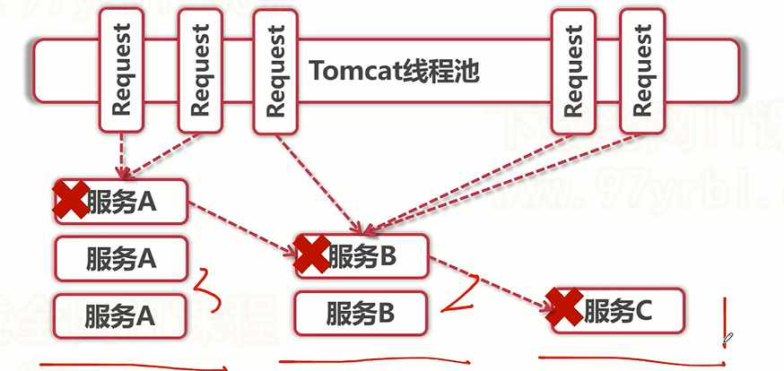

## 服务容错的解决方案

### 服务雪崩

缓存雪崩这个词，大伙应该都听说过，那么服务雪崩是什么呢？让我们看下面这张图



- 首先我们可以看到，服务A有3个节点，承接的请求多，服务B2个节点，请求中等，服务C 1个节点，请求最少
- 当服务C出现了问题，无法提供服务，因为服务B调用了服务C，所以会导致服务B也出现问题，同理导致服务A也崩了，这就是服务雪崩

可以看出这种问题很严重，应该如何处理呢？

SpringCloud微服务的著名合伙人之一Netflix又出来大展身手了，发布了Hystrix组件，专门用来服务容错的处理

- 服务降级：交由备选方案planB来处理请求
- 服务熔断：比服务降级更高一层，直接将服务断开不再使用

具体介绍后面再说

### 容器线程耗尽

这个是更加严重的一个问题，因为当容器的线程耗尽，你在此个容器下部署的所有集群节点，都会变为不可用状态，因为线程被耗尽，请求无法进来，如下图：


- 服务ABC的响应速度都很快，并且从线程池获取线程都是平均的
- 当服务C出现问题，他可以处理请求，但是会因为各种性能瓶颈，导致响应速度特别慢，比如1-2分钟才可以响应请求
- 那么请求进来，就会等待，一直耗着，这样越来越多的请求会在服务C这里耗着，导致后面容器线程全部耗尽

这种又应该怎么办呢？

Hystrix就有个独门武功，线程隔离

### 生产故障

遇到生产故障不要慌，我们解决了之后，要进行反思，如何可以降低故障频率呢？


使用Hystrix就可以实现

## Hystrix核心功能

从我们上面介绍，我们知道Hystrix有三个核心功能，断舍离！不是，服务降级，服务熔断，线程隔离~ 其实也就是断舍离

1. 断 - 服务熔断
2. 舍 - 服务降级
3. 离 - 线程隔离

### 服务降级

微服务架构一般都是强调高可用性，但是一致性的要求就没有这么高了，也就是说，在日常服务调用时，会出现服务调用异常的情况，比如：

- 当服务重启，需要先发送下线指令给注册中心，然后就下线了，注册中心多节点还没来得及同步，请求就过来了，请求到已经下线的服务，就会出现404
- 又或者我们刚刚上面说的雪崩问题，最上游的服务出现问题，下游所有应用都会受到牵连


这时就需要服务降级来应对上面的情况了，加入HystrixClient调用目标请求发生异常后，会自动把该请求转到降级逻辑中来处理，是**由服务调用方编写的异常处理逻辑**。对于响应超时的场景，我们可以使用Hystrix设置超时时间，一旦发生超时，也会被认为出现了异常交由降级逻辑Fallack来处理

#### 原理解析

借势我们介绍一下服务降级的相关原理，因为很复杂很复杂的逻辑，所以我们只看最核心的逻辑

Hystrix就好像六扇门，而服务降级可以说是锦衣卫，专门打老虎：

```java
@HystrixCommand(fallbackMethod = "putInPrison")
public String bigTiger(){
	throw RuntimeExcaption("Eat people");
}
```

上面就是锦衣卫@HystrixCommand，直接管在大老虎头（具体Method）上，当执行失败，就会关进监狱（调用降级方法）

当Hystrix和Feign一起使用时，还有一种配置方式，在@FeignClient注解上添加一个class，这样，Feign中所有方法都会被这个降级接口来处理

```java
@FeignClient(name = "feign-client",fallback = Fallback.class)
public interface Hello{
}
```

了解完如何使用的时候，我们会发现，基本都是依靠@HystrixCommand注解来实现，那么为何加了个注解就可以在方法失败后走向降级方法呢？

这时我们可能会思考到，使用**AOP**可不可以？设置切面，当发生异常时进行处理，其实就是这样。

因为源码非常繁琐，使用大量异步回调以及事件监听机制，我们直接看最核心流程：


1. **@HystrixCommand注解**，标识方法被我掌管了
2. **AspectJ**：运用Spring切面能力，为@HystrixCommand注解标注的 方法设置切面，在方法调用时，首先执行切面逻辑
3. **RequestCache**：
   - 开启：尝试使用CacheKey从缓存中获取数据，不发起方法调用
   - 关闭，就来到非常复杂的流程了，Observer
4. **注册Observer**：观察者模式，说是观察者模式，其实运用了**大量的RxJava的异步回调函数**，当方法正常执行，抛出异常，结束或其他状态时，会触发对于的回调函数进行处理，而且回调函数里可能还嵌套回调函数（Hystrix程序员不知道怎么想的，估计有个怕失业的程序员，这谁接手不是一头雾水）
5. **发起调用**：注册好一系列回调函数后，就可以发起调用了，先会判断是否在熔断状态，如果断路器开启值机fallback，如果没有，发起调用
6. **异常fallback**：我前面做了这么一大堆文章，不就是在等你吗？当发生异常，Hystrix开心了，终于派上用场了，这时**异常就会触发步骤四中的回调函数，转给降级方法进行处理**

#### 服务降级常用方案

##### 静默处理 - 沉默是金

静默处理，就是啥也不干，比如直接返回个null。

那么，为什么要这么做呢？把他直接通过try/catch包住不就行了？首先try/catch只能处理异常抛出情况，不能处理超时情况，其次就是开闭原则单一职责原则，既然可以使用fallback进行统一处理，为什么不用呢？

##### 默认值 - 瞒天过海

瞒天过海，就是骗人，无论你请求参数是什么，我们都返回一个默认的值。

这种处理方法，需要在特殊的业务逻辑中使用，比如商品详情页，需要调用营销接口，如果出现问题，就可以直接返回这个商品的原价，但是不能使用在创建订单，提交订单页面，因为这就和真实的金钱挂钩了，如果没有给用户进行打折，肯定会出现大量投诉

##### 想办法恢复服务 - 好好改造

这才是正儿八经积极进行处理的方式，fallback会尝试各种方式来恢复正确的返回值，有几个场景：

1. **缓存异常**：如果因为缓存故障导致的无法获取数据，可以在fallback逻辑中写入使用数据库查询来获取数据，但是不能用在热点数据，当然这也可以用在数据库故障，切换从缓存获取数据
2. **切换备库**：如果是主从备库这种结构，从主从库中无法获取数据出现了故障，我们可以主动切换备库来获取数据
3. **重试**：fallback中可以主动发起调用进行重试
4. **人工干预**：有些重要的接口，出现异常很严重的情况下，可以在fallback中为日志打点或触发监控组件预警等方式，同时进行人工干预

##### 多次降级 - 一错再错

当程序在fallback中再次报错，那么可以在fallback中再次进行fallback降级方法，一层套一层，这是很正常的，越是复杂核心的业务可能套娃套的越多~

当然如果一层一层全都报错，锦衣卫都管不住你了，就只能将你公之于众把异常抛到最外层

##### RequestCache

刚刚我们在原理解析里，发现有一个RequestCache，这是Hystrix一个特殊功能，可以通过@CacheResult和@CacheKey两个注解进行配置

```java
@CacheResult
@HystrixCommand
public String requestCache(@CacheKey Integer id)
```

这样第一次进入时，id为1，获取数据后，就会将返回的数据缓存到Hystrix里，下次再请求id为1的数据就会直接从Hystrix缓存中缓存

这个方式其实是一种**性能优化**而不是降级容错

### 服务熔断

服务熔断是建立在服务降级上的一种服务容错策略，是升级版。服务降级是服务发送HTTP请求，返回异常后，在启用planB，而服务熔断是什么，当断路器打开后，所有请求都直接去planB，不在尝试请求服务提供方


那么就会发现，断路器开启关闭的规则就很重要了，比如每10个请求，失败了80%就开启熔断。当然，熔断器打开后，也不可能一直开着，肯定会配有一些规则，主动判断关闭时机。

断路器 显著缓解QPS激增导致的雪崩效应

### 线程隔离


线程隔离是用来处理上面说的容器线程耗尽问题的，Hystrix可以为每个服务节点配置最大获取线程数，当服务出现问题时，会一直占用容器线程，但是如果达到了最大线程数，就无法获取线程了，所以不会影响容器其他服务节点，也就叫做线程隔离

