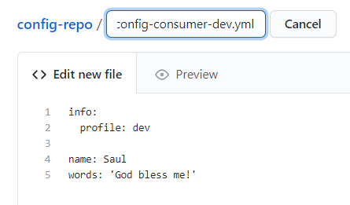
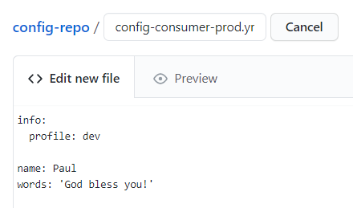
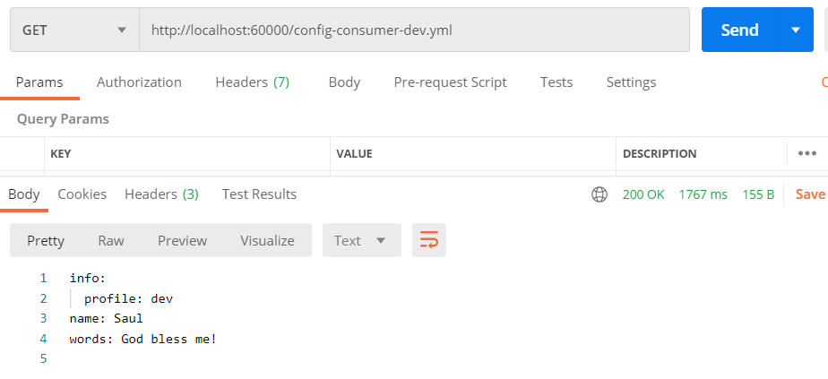

## 配置中心的作用

配置中心？为什么要这个东西呢？我们先从现在的配置模式来看：


常规情况下，我们的配置都是像上面一样：

- 直接写死在代码中
- 使用配置文件存储读取
- 加载到环境变量中读取
- 通过数据库存储

那么这些配置是否有问题呢？当然：


- 写死在代码中：每次修改配置都有重新部署，最差的方式！
- 使用配置文件：因为配置文件格式不同，导致不统一，可能又有properties又有yml，就很繁琐了
- 使用数据库：没有版本控制，如果我们修改错某个配置了，想要回滚很麻烦
- 环境变量：更不用说了，首先我们需要记住配置了哪些在环境变量，然后每次修改也很麻烦，没有统一的管理

通过上面这些缺点，我们配置中心的作用也显而易见了，就是将上面那些确定反转过来：


- 具有版本管理功能：可以配置权限，获取修改记录
- 高可用，可以搭建集群式的配置中心
- 可以针对需要，对一些配置进行加密
- 中心化管理，其实就是git

**其实配置中心的实现方式多种多样，对于SpringCloud Config来说，他是Spring公司开发的，一般是基于git来实现中心化管理配置**

再额外说一点，就是关于配置的，哪些配置是静态配置，不怎么修改的，哪些事动态配置，可能需要经常修改的呢？如下图：


## SpringCloudConfig介绍

前面我们了解了配置中心，接下来我们了解一些SpringCloud Config这个配置中心组件

### Config Server核心功能

Config作为SpringCloud官方指定组件，提供了三个主要功能：


- **统一配置**：提供了中心化的配置方案，将所有的配置都集中在Config Server端
- **环境隔离**：提供多种环境隔离机制，对于Client来说，可以根据自己的需要，从Config Server拉取对应的配置
- **动态刷新**：支持运行期间进行配置的修改

除了上面这些功能，还有其他加密解密，定向推送等功能

### Config Server实现原理

我们老套路，先了解一些Config Server的原理，再对其进行demo级别的学习


- **自动装配**：老生常谈，Config Server也是通过一个注解`@EnableConfigServer`来开启配置中心的，Config内部通过一系列的`@Import`来引入其他的配置类，完成自动装配（ConfigServerAutoConfiguration）
- **环境仓库装配**：启动自动装配后，自然要从配置的存储仓库拉取配置了，交由EnvironmentRepositoryConfiguration来实现，可以通过JDBC，SVN，Git等方式进行存储，默认情况下推荐使用Github
- **对外REST接口**：拉取完配置后，自然是要开放接口给外部，来获取配置，通过`EnvironmentController`这个类对外暴露接口，通过不同的url获取不同的配置

除此之外，ConfigServer还具备格式转换功能，比如Client需要yml形式的配置，那么如果只有properties，它会自动转换格式为yml形式进行返回

### Config Client实现原理

简单了解完Server实现原理，我们来看看Client是如果拉取配置，在何时拉取的呢？


1. **SpringBoot Context初始化**：这是SpringBoot启动时必做的一件事，也就是在run时prepareContext生成上下文对象
2. **加载initializer**：加载所有的初始化器，其中PropertySourceBootstrapConfiguration作为配置文件的初始化器，来进行配置的初始化
3. **属性资源初始化**：PropertySourceBootstrapConfiguration加载时，是通过locator定位资源文件的，而当我们引入Config-client依赖后，就会启动Config的自动装配，为`ConfigServerBootstrapConfiguration`实现，这个自动装配的过程中，就会向locator列表添加一个专门获取远程文件的类-`ConfigServicePropertySourceLocator`
4. **拉取远程文件**：`ConfigServicePropertySourceLocator`定义了优先级@Order(0)即优先级最高，所以他会最先从Config Server拉取配置，进行配置绑定

通过最后一点，我们会发现一个优先级问题，这里给出一点小Tips：

- **bootstrap.yml 》 application.properties 》 application.yml**
- **所以我们可以将Config的配置放到bootstrap中优先加载**

## 实现配置中心

在实现配置中心之前，我们还需要了解一些东西~

### 简单了解如何实现


首先就是他的组织架构：由Config 组件拉取Github上保存的配置，保存一份放到本地，各个Server节点获取配置

Config Server主要有两种工作模式：

- 与仓库对接：比如Github，将配置保存到Github上，Config Server从中拉取配置信息（如果是Github的私有项目，我们需要将Github的用户名密码加密存储到配置中进行连接）

- 自立门户：不与Github合作了，直接我自己就是存储配置文件的地方，将文件保存到本地，读取文件
  - 需要开启配置：`spring.profiles.active=native`

这里我们使用最经典的第一种方式，也就是和github配合

配置起来非常简单，只需要指定github地址即可：

```properties
spring.cloud.config.server.git.url=https://github.com/xxxx/config-repo.git
# 指定目录
spring.cloud.config.server.git.search-paths={/appName}
```

**接着我们来实现一个配置中心**

### 创建Github仓库

首先我们需要创建一个Github仓库，这里我命名为`config-repo`

然后我们需要创建文件，这里文件的名字很重要，有一些潜规则：

- 一般来说，命名为`{appName}-{profile}.yml/properties`，比如`config-consumer-dev.yml`



这里我们创建了一个dev环境的配置文件，然后我们再创建一个生产环境的prod配置文件：



这样，我们的Git仓库环境就准备好了~

### 实现Config Server

Config Server非常简单，没有什么配置项

**1.创建`config-server`工程，并添加依赖|**

```xml
<dependencies>
    <dependency>
        <groupId>org.springframework.cloud</groupId>
        <artifactId>spring-cloud-config-server</artifactId>
    </dependency>
</dependencies>
```

**2.创建启动器类**

```java
@SpringBootApplication
@EnableConfigServer
public class ConfigServerApplication {
    public static void main(String[] args) {
        SpringApplication.run(ConfigServerApplication.class,args);
    }
}
```

**3.添加配置文件**

```yml
spring:
  application:
    name: config-server
  cloud:
    config:
      server:
        git:
          uri: https://github.com/PAcee1/config-repo.git
          # 强制拉取
          force-pull: true
#          username:
#          password:
#          search-paths: foodie,xcEdu # 配置拉取某个目录下
server:
  port: 60000
```

可以看到，非常简单就实现了配置中心

接下来我们要测试一下拉取github上的配置，这里主要有两种方式：

```
第一种，使用`/`来分割应用名称，环境，以及分支
http://localhost:60000/{application}/{profile}/{label} (label不写默认为master)
例如：http://localhost:60000/config-consumer/dev

第二种，使用`-`来连接
http://localhost:60000/{label}/{application}-{profile}.(json/yml/properties)
例如：http://localhost:60000/config-consumer-dev.yml
```




可以到，两种方式都可以，但是第二种会直接获取文件内容，而第一种会有一些其他信息