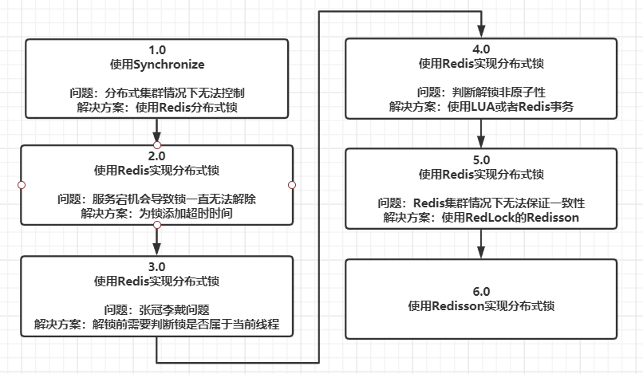

## 什么是分布式锁？为什么使用Redis当分布式锁

Redis除了做缓存外，还可以当分布式锁，这也是Redis必考面试题

直接看面试题：

- Redis除了缓存，还能做什么？
- Redis使用分布式锁，有没有什么需要注意的问题
- Redis单点部署有什么问题
- 集群模式主从模式有什么问题
- RedLock和Redisson介绍一下
- Redis锁如何续期，看门狗知道吗？

在学习Redis分布式锁相关知识之前，我们先看看一些前景说明

Redis为什么可以当分布式锁？

- **Redis是单线程的**，这样所有操作进来后，都要一个个排队执行，这就**一定是线程安全的**，就可以当做锁来用

Redis分布式锁有哪些使用方式？

- 自己手写：string setnx + lua脚本
- 使用框架：Redisson

## Redis分布式锁的逐步衍变

场景：秒杀，使用伪代码

商品库存数保存在Redis中

### 1.0版本

```java
public void buy(){
    synchronize(this){
        String result = redisTemplate.opsForValue().get("goods:001");
        int goodsNum = result == null? 0 : Interger.parseInt(result);
        if(goodsNum > 0){
            // 商品卖出，库存建议
            redisTemplate.opsForVaule().set(goodsNum - 1);
        }else{
            // 商品售完
        }
    }
}
```

1.0版本是最基础的逻辑代码，单机多线程情况下，没有任何问题

**问题**：分布式，多服务的场景下就会出现问题，因为单机锁只能控制单服务本身

**解决方案**：使用分布式锁

### 2.0版本

加入Redis分布式锁

```java
public static final String REDIS_LOCK = "myLock";
public void buy(){
    // 使用setnx实现分布式锁
    String value = UUID.randomUUID().toString() + Thread.currentThread().getName();
    // 如果不存在则可以成功设置，为true，设置不成功为false，说明锁被使用中
    boolean lock = redisTemplate.opsForValue().setIfAbsent(REDIS_LOCK,value);
    try{
        // 如果获取到锁了
        if(lock){
            String result = redisTemplate.opsForValue().get("goods:001");
            int goodsNum = result == null? 0 : Interger.parseInt(result);
            if(goodsNum > 0){
                // 商品卖出，库存建议
                redisTemplate.opsForVaule().set(goodsNum - 1);
            }else{
                // 商品售完
            }
        }
    }finally{
        // 删除key，代表解锁
        redisTemplate.delete(REDIS_LOCK);
    }
}
```

我们加入了Redis锁，看起来是没问题了

**问题**：如果该程序运行到一半宕机了，那么锁无法释放，就会一直卡主其他的服务集群

**解决方案**：为key设置过期时间

### 3.0版本

```java
public static final String REDIS_LOCK = "myLock";
public void buy(){
    // 使用setnx实现分布式锁
    String value = UUID.randomUUID().toString() + Thread.currentThread().getName();
    // 如果不存在则可以成功设置，为true，设置不成功为false，说明锁被使用中
    // 设置10秒过期时间
    boolean lock = redisTemplate.opsForValue().setIfAbsent(REDIS_LOCK,value,10L,TimeUnit.SECONDS);
    try{
        if(lock){
            String result = redisTemplate.opsForValue().get("goods:001");
            int goodsNum = result == null? 0 : Interger.parseInt(result);
            if(goodsNum > 0){
                // 商品卖出，库存建议
                redisTemplate.opsForVaule().set(goodsNum - 1);
            }else{
                // 商品售完
            }
        }
    }finally{
        redisTemplate.delete(REDIS_LOCK);
    }
}
```

3.0版本在2.0版本上再次改进，加入了过期时间，这样程序宕机也会自动解锁

**问题**：张冠李戴，如果A线程运行时发生了异常，比如网络不好，导致**业务执行时间超出预期**，比如30秒，但是因为过期时间，10秒锁就被释放了，那么在其他线程加锁执行的过程中，A线程30秒执行完了，就会**把其他线程的锁给释放**，就会出现问题

**解决方案**：解锁时判断值是否相同，即判断该锁是否属于当前线程

### 4.0版本

```java
public static final String REDIS_LOCK = "myLock";
public void buy(){
    // 使用setnx实现分布式锁
    String value = UUID.randomUUID().toString() + Thread.currentThread().getName();
    // 如果不存在则可以成功设置，为true，设置不成功为false，说明锁被使用中
    // 设置10秒过期时间
    boolean lock = redisTemplate.opsForValue().setIfAbsent(REDIS_LOCK,value,10L,TimeUnit.SECONDS);
    try{
        if(lock){
            String result = redisTemplate.opsForValue().get("goods:001");
            int goodsNum = result == null? 0 : Interger.parseInt(result);
            if(goodsNum > 0){
                // 商品卖出，库存建议
                redisTemplate.opsForVaule().set(goodsNum - 1);
            }else{
                // 商品售完
            }
        }
    }finally{
        // 解锁前先比较锁是否属于当前线程
        if(value.equals(redisTemplate.opsForValue().get(REDIS_LOCK))){
        	redisTemplate.delete(REDIS_LOCK);
        }
    }
}
```

4.0版本再次改进，避免张冠李戴，线程解锁其他线程的锁的情况

**问题**：比较与解锁是两个操作，不是原子性还是会有线程安全问题

**解决方案**：使其变成原子性操作

### 5.0版本

想要使比较并解锁变成原子性操作，Lua脚本就是最常用也是最好用的方式了。

但是有些面试官就会问，不用lua脚本可不可以？那就是使用Redis事务了

Redis事务常用操作：

- MULTI：开启事务
- EXEC：执行事务
- WATCH：事务需要按条件执行时，使用这个来监控键的状态
  - 类似乐观锁，事务提交时会判断该键是否被修改了，如果没有被修改就可以提交，否则失败
- UNWATCH：结束监控

```java
public static final String REDIS_LOCK = "myLock";
public void buy(){
    // 使用setnx实现分布式锁
    String value = UUID.randomUUID().toString() + Thread.currentThread().getName();
    // 如果不存在则可以成功设置，为true，设置不成功为false，说明锁被使用中
    // 设置10秒过期时间
    boolean lock = redisTemplate.opsForValue().setIfAbsent(REDIS_LOCK,value,10L,TimeUnit.SECONDS);
    try{
        if(lock){
            String result = redisTemplate.opsForValue().get("goods:001");
            int goodsNum = result == null? 0 : Interger.parseInt(result);
            if(goodsNum > 0){
                // 商品卖出，库存建议
                redisTemplate.opsForVaule().set(goodsNum - 1);
            }else{
                // 商品售完
            }
        }
    }finally{
        // 解锁前先比较锁是否属于当前线程
        // 使用Redis事务实现
        while(true){ // 自旋锁
            // 监控字段
            redisTemplate.watch(REDIS_LOCK);
            // 如果相等，进入
            if(value.equals(redisTemplate.opsForValue().get(REDIS_LOCK))){
                redisTemplate.setEnableTransactionSupport(true);
                redisTemplate.multi();
                redisTemplate.delete(REDIS_LOCK);
                List list = redisTemplate.exec();
                // 执行，这时如果字段在监控期间被修改了，则不执行，重试                
                if(list == null){
                    continue;
                }
            }
            redisTemplate.unwatch();
            break;
        }
        
        // 使用Lua脚本实现
        // jedis需要配置
        String lua = "if redis.call(\"get\",KEYS[1]) == ARGV[1]\n" +
                "then\n" +
                "    return redis.call(\"del\",KEYS[1])\n" +
                "else\n" +
                "    return 0\n" +
                "end";
        Object o = jedis.eval(lua,Collections.singletonList(REDIS_LOCK),Collections.singletonList(value);
        }
        
    }
}
```

这里我们使用LUA和事务两种方式实现了原子性校验解锁。

对于我们人工实现的Redis分布式锁到这已经可以了，可以应对最基本的场景。

但是对于超高并发量还是有问题的

**问题**：

- Redis过期时间应该大于业务执行时间：涉及到了锁的续期问题
- Redis集群中的AP问题：Redis是保证高可用和分区容错的，对于一致性要求并不高，这就导致一个问题。如果我们的锁刚刚加到主节点，但是主节点还没有向从节点同步就挂了，导致我们的锁就相当于消失了，在从节点上位后，锁不存在，就会又有新线程进来，出现线程安全问题

**解决方案**：使用Redis推出的基于RedLock的Redisson脚手架

### 6.0版本

直接使用Redisson，简单好用

```java
@Autowire
private Redisson redisson;
public static final String REDIS_LOCK = "myLock";

public void buy(){
    // 使用setnx实现分布式锁
    String value = UUID.randomUUID().toString() + Thread.currentThread().getName();
 	// 使用Redisson
    RLock rlock = redisson.getLock(REDIS_LOCK);
    // 上锁
    rlock.lock()
    try{
        // 如果获取到锁了
        String result = redisTemplate.opsForValue().get("goods:001");
        int goodsNum = result == null? 0 : Interger.parseInt(result);
        if(goodsNum > 0){
            // 商品卖出，库存建议
            redisTemplate.opsForVaule().set(goodsNum - 1);
        }else{
            // 商品售完
        }
    }finally{
        // 判断并解锁
        if(rlock.isLocked() && rlock.isHeldByCurrentThread()){
        	rlock.unlock()
    	}
    }
}
```

所以，我们直接使用Redisson其实最简单合理

但是我们要明白为什么使用Redisson，自己实现的有什么缺点

### 总结

我们从一开始的单机加锁到最后使用Redisson分布式锁，总结一下：



**使用Redis+LUA方式实现分布式锁有哪些注意事项？**

- 需要设置超时时间
- 解锁前需要判断是否属于当前线程的锁
- 判断和解锁需要原子性操作
  - LUA
  - Redis事务

**为什么使用Redisson？**

因为自己实现的Redis分布式锁无法解决集群带来的线程安全问题，因为Redis是AP架构的。所以我们要使用Redis自己提供的基于RedLock实现的Redisson。

